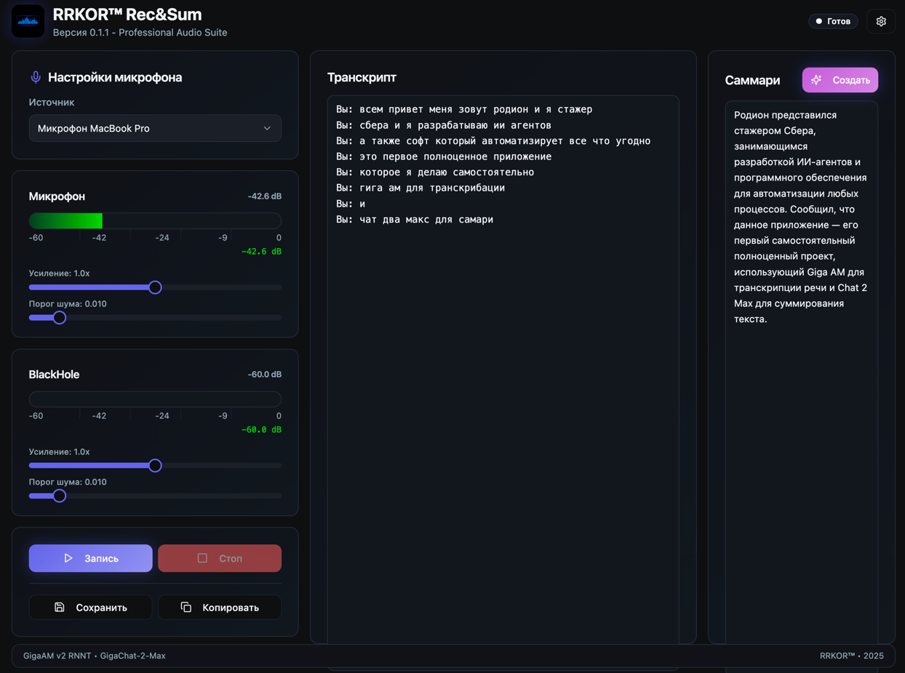
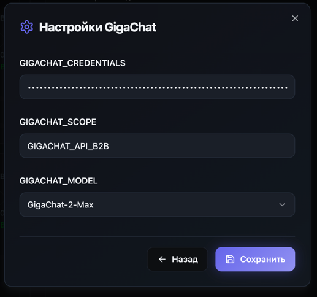

# RRKOR™ Rec&Sum - Alpha 0.1.1

Профессиональное приложение для записи аудио, транскрипции и создания саммари с использованием ИИ.

## 🚀 Быстрый старт

### Предварительные требования

1. **Python 3.8+**
2. **Node.js 18+** и **npm**
3. **BlackHole 2ch** (для macOS) - [скачать здесь](https://existential.audio/blackhole/)
4. **GigaChat API ключи** (для саммари)

### Установка

1. **Клонируйте репозиторий:**
```bash
git clone <repository-url>
cd rrkor-rec-sum-new
```

2. **Установите Python зависимости:**
```bash
pip3 install -r requirements.txt
```

3. **Установите Node.js зависимости:**
```bash
cd front
npm install
```

### Запуск

1. **Соберите фронтенд:**
```shell
python desktop_app.py
```


## 🎯 Возможности

### ✅ Реализовано
- [x] Запись аудио с двух источников (микрофон + BlackHole)
- [x] Транскрипция в реальном времени с GigaAM
- [x] Разделение речи на "Вы" и "Собеседник"
- [x] Настройка усиления и порогов шума
- [x] Выбор микрофона
- [x] Пауза/возобновление записи
- [x] Сохранение транскрипта
- [x] Создание саммари с GigaChat
- [x] WebSocket для обновлений в реальном времени
- [x] Современный React + TypeScript интерфейс

### 🔧 Технические особенности
- **Бэкенд:** FastAPI + WebSocket + GigaAM + GigaChat
- **Фронтенд:** React + TypeScript + Tailwind CSS + shadcn/ui
- **Аудио:** sounddevice + scipy + numpy
- **ИИ:** GigaAM v2 RNNT для транскрипции, GigaChat для саммари

## 📁 Структура проекта

```
rrkor-rec-sum-new/
├── main.py                 # Основной бэкенд сервер
├── requirements.txt        # Python зависимости
├── front/                  # React фронтенд
│   ├── src/
│   │   ├── components/     # React компоненты
│   │   ├── hooks/         # React хуки
│   │   ├── lib/           # Утилиты и API клиент
│   │   └── pages/         # Страницы
│   ├── package.json       # Node.js зависимости
│   └── dist/              # Собранный фронтенд
├── GigaAM/                # Модель GigaAM
├── data/                  # Данные и файлы
├── logs/                  # Логи
└── temp_segments/         # Временные аудио сегменты
```

## 🔌 API Endpoints

### REST API
- `GET /api/health` - Проверка состояния сервера
- `GET /api/devices` - Список доступных устройств
- `POST /api/microphone` - Выбор микрофона
- `GET /api/state` - Текущее состояние записи
- `POST /api/record/start` - Начать запись
- `POST /api/record/pause` - Пауза записи
- `POST /api/record/resume` - Возобновить запись
- `POST /api/record/stop` - Остановить запись
- `POST /api/settings` - Обновить настройки
- `GET /api/transcript` - Получить транскрипт
- `POST /api/transcript/save` - Сохранить транскрипт
- `POST /api/summarize` - Создать саммари

### WebSocket
- `ws://127.0.0.1:8000/ws/transcript` - Обновления транскрипта
- `ws://127.0.0.1:8000/ws/levels` - Уровни аудио в реальном времени

## 🎛️ Настройки

### Аудио настройки
- **Усиление микрофона:** 0.0 - 2.0x
- **Усиление BlackHole:** 0.0 - 2.0x
- **Порог шума микрофона:** 0.001 - 0.1
- **Порог шума BlackHole:** 0.001 - 0.1

### Требования к системе
- **macOS:** BlackHole 2ch должен быть установлен и настроен
- **Микрофон:** Любое устройство ввода аудио
- **Память:** Минимум 4GB RAM для работы с ИИ моделями

## 🐛 Устранение неполадок

### Проблемы с BlackHole
1. Убедитесь, что BlackHole 2ch установлен
2. Проверьте настройки аудио в macOS
3. Перезапустите приложение

### Проблемы с GigaAM
1. Установите GigaAM: `pip install gigaam`
2. Проверьте доступ к модели
3. Убедитесь в достаточном количестве RAM

### Проблемы с GigaChat
1. Проверьте переменные окружения
2. Убедитесь в валидности API ключей
3. Проверьте интернет соединение

## 🧪 Тестирование

Запустите тестовый скрипт:
```bash
python3 test_frontend.py
```

## 📝 Лицензия

Проект разработан для внутреннего использования.

## 🤝 Поддержка

При возникновении проблем создайте issue в репозитории или обратитесь к разработчику.
